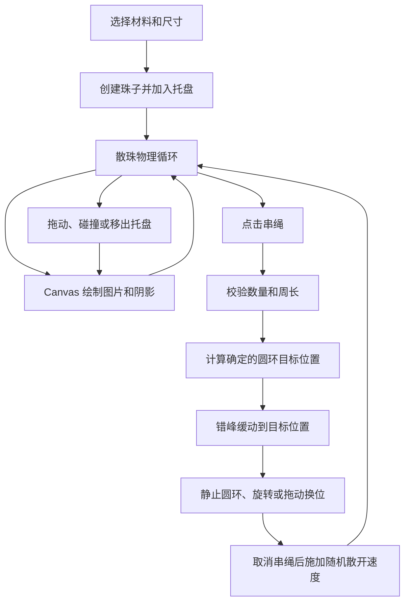

# DIY 页面动画与碰撞实现分析

> 分析日期：2026-07-20  
> 新版项目：`C:\Users\hzm\WeChatProjects\miniprogram-2`  
> 对照项目：`C:\Users\hzm\WeChatProjects\miniprogram-1`

## 1. 结论先行

可以使用现成库，但不建议把整个 DIY 页面交给一个游戏引擎，也不建议照搬旧版的碰撞代码。

当前最合适的方案是：

1. **散珠状态的碰撞与运动**：先用 Matter.js 做一个小范围技术验证。验证通过后，只使用它的物理核心，不使用它的渲染器、鼠标模块和页面框架。
2. **串成手链后的圆环排布、串珠/散开动画、拖动换位**：继续使用重新编写的确定性业务算法。这部分不是通用刚体物理，而是产品规则，物理库反而会让结果不稳定、难以复现。
3. **珠子图片、阴影、托盘和选中状态的绘制**：使用微信小程序 Canvas 2D 自己绘制。物理库只计算位置，不负责最终视觉。
4. **如果 Matter.js 在真机包体、兼容性或性能测试中不合格**：退回到一个小而清晰的 TypeScript 碰撞模块。旧版真正的问题不是“自己算碰撞”本身，而是多年累积后把物理、渲染、图片缓存、声音、拖动、业务状态和兼容分支混在了同一套组件中。

因此，现阶段不应直接确定“必须使用 Matter.js”，而应先做一个最多 40 颗圆形珠子的验证版本，再根据真机数据决定。推荐级别是：**值得验证，验证通过后采用**。

## 2. 本次分析范围

本次只分析 DIY 主页面需要的能力：

- 材料分类、规格与珠子添加；
- 托盘内散珠的运动、边界和碰撞；
- 手指拖动、珠子移除；
- 串成手链、散开、圆环旋转与珠子换位；
- 数量、价格、周长等页面状态；
- Canvas 图片绘制和动画调度。

明确不在本次范围内：

- DIY 店面二级页面；
- 商品详情、订单、地址、交易等页面；
- 对旧版进行重构或修改；
- 在新版提前搭建通用框架、全局状态或额外架构目录。

旧版中与订单、交易、个人中心等功能的导入关系，只用于确认旧代码为什么难以维护，不作为新版的实现范围。

## 3. 新版当前状态

新版的 `pages/diy` 目前还是占位页面：

- `pages/diy/index.ts` 只负责同步自定义 Tab 选中状态；
- `pages/diy/index.wxml` 只有占位内容；
- `pages/diy/index.wxss` 只有页面背景；
- 项目没有生产依赖，也没有物理或动画库。

新版已有 `components/bracelet-preview`，并被设计卡片和设计详情复用。它负责**静态预览**，不是可交互的 DIY 托盘。其圆环尺寸算法和旧版 DIY 的算法表达不同，坐标尺度也不同。在开始实现 DIY 前，应先用相同手链数据对照截图和最终周长，确认两个场景需要统一到什么程度；不能因为名称相似就直接合并代码，也不应为了共享而改动已验收页面。

## 4. 旧版 DIY 的实际结构

旧版并不是一个单纯页面。页面通过 `components/bracelet-tray` 承担核心交互，而该组件又把多种职责集中在一起：

- 物理模拟；
- Canvas 绘制；
- 图片加载、预热、重试和多级缓存；
- 触摸命中、拖动、旋转和删除；
- 串珠动画与换位；
- 碰撞及边界声音；
- 分享图和照片画布；
- 对外状态同步。

核心流程可概括为：



旧版复杂度较高的主要原因，不是碰撞公式特别高深，而是这些职责长期堆积在一个组件里。组件中还保留了已经被整体关闭的 DOM 串珠覆盖层相关路径，这类失效分支进一步增加了理解和维护成本。

## 5. 旧版动画和碰撞到底做了什么

### 5.1 散珠状态

旧版使用接近 Verlet 的位置积分方式。每颗珠子保存当前位置和上一次位置，二者的差值代表速度：

```text
velocityX = (x - oldX) * friction
velocityY = (y - oldY) * friction
oldX = x
oldY = y
x += velocityX
y += velocityY
```

主要参数为：

| 参数 | 旧版取值或规则 |
| --- | --- |
| 物理步长 | 固定 `1000 / 60 ms` |
| 单帧最多补算 | 2 次 |
| 阻力系数 | `0.96` |
| 托盘边界反弹 | `0.6` |
| 默认毫米到像素 | `2.836 px/mm` |
| 最大珠子数量 | 40 |
| 最大允许周长 | 300 mm |
| 重力 | 无 |

使用固定物理步长是正确方向：显示帧率变化时，模拟速度不会跟着明显变化。但旧版的散珠只要存在，就会持续请求动画帧，即使所有珠子已经肉眼静止，也没有真正进入休眠。这会产生不必要的碰撞计算和 Canvas 重绘。

### 5.2 圆形托盘边界

每颗珠子都被限制在一个圆形托盘内。设托盘半径为 `trayRadius`，珠子物理半径为 `beadRadius`：

```text
maxCenterDistance = trayRadius - beadRadius
```

当珠子中心到托盘中心的距离超过该值时：

1. 把珠子中心拉回圆周内；
2. 求边界法线；
3. 把速度在法线方向上的分量反射；
4. 乘以反弹系数，形成能量损失。

这个逻辑很短，使用物理库后也未必能完全删除。Matter.js 没有一个直接表示“物体必须待在圆形容器内部”的单一内壁对象；通常需要用多段静态边界近似圆环，或者保留一小段径向约束代码。

### 5.3 珠子之间的碰撞

两颗珠子的最小中心距离不是只看图片尺寸，而是按业务尺寸和间距比例计算：

```text
minimumDistance =
  (left.mm * left.gapRatio + right.mm * right.gapRatio)
  * pxPerMm / 2
```

如果实际距离小于最小距离，旧版把重叠量沿两颗珠子的连线方向分开：

- 普通碰撞时双方各移动一半；
- 其中一颗正被手指拖动时，被拖动珠子视为不可移动，另一颗承担全部位置修正；
- 相对速度或重叠较大时，可以触发碰撞声音。

为了减少碰撞候选数量：

- 少于 12 颗时直接检查所有珠子对，复杂度为 `O(n²)`；
- 12 颗及以上时使用均匀网格，只检查所在格和周围 8 个格子。

对于上限只有 40 颗的圆形珠子，这套数学本身并不差。主要缺点是它与拖动、声音、渲染循环和大量缓存代码缠在一起，而且没有休眠机制。

### 5.4 串成手链后的排布

串珠状态不是碰撞模拟，而是确定性几何计算。每颗非吊坠材料占用的周长为：

```text
footprintMm = beadSizeMm * gapRatio
```

总周长和圆环半径为：

```text
circumferenceMm = sum(footprintMm)
radiusMm = circumferenceMm / (2 * PI)
radiusPx = radiusMm * pxPerMm
```

每颗珠子占据的角度与它占用的周长成比例。吊坠不增加圆环周长，但会挂在当前角度位置。珠子的图片朝向根据切线方向、是否吊坠、是否向外悬挂等字段决定。

串珠动画使用 `easeOutCubic`，动画时长约为 460 至 760 ms，并给珠子增加少量错峰时间。动画结束后直接落到精确目标值，避免浮点误差长期积累。

这部分需要在新版重新编写，但不应交给刚体约束系统，因为它必须满足以下业务要求：

- 相同材料顺序得到完全相同的手链；
- 价格和周长计算可复现；
- 保存后再次打开的位置一致；
- 拖动换位后顺序明确；
- 动画结束时没有物理抖动。

### 5.5 触摸交互

旧版触摸逻辑包括：

- 把屏幕坐标换算为 Canvas 逻辑坐标；
- 按珠子层级倒序命中；
- 散珠拖动时，用碰撞求解器推开其他珠子；
- 手链状态拖动珠子时，寻找最近的圆环插入角度；
- 拖动圆环空白处时旋转整串手链；
- 珠子移出托盘一定距离后删除；
- 松手后重新生成确定的圆环顺序和目标位置。

这些规则依赖微信触摸事件和 DIY 产品行为，不能直接使用 Matter.js 的 `MouseConstraint`。新版仍要自己完成坐标转换、命中和业务操作，再调用物理对象的移动或唤醒接口。

## 6. 运行时验证结果

除静态阅读外，本次还在旧版微信开发者工具运行了 DIY 页面，验证了实际行为。测试结束后已清空临时加入的珠子，没有修改旧版文件或持久化业务数据。

验证到的结果：

- 页面能够进入可交互状态；
- 主分类共 6 个，当前分类下有 10 个子分类；
- 材料数据来自 `GET /backend/api/bead/list.php`，公开设置来自 `GET /backend/api/settings/public.php`；
- 以 10 颗、10 mm、间距比例 0.97 的白水晶测试时：
  - 总价为 80；
  - 总周长为约 97 mm；
  - 可以从散珠切换为手链圆环；
  - 可以再清空并恢复初始状态；
- 开发者工具中没有出现 JavaScript 异常，但出现过远端 WebP 图片加载失败，以及开发者工具不支持音频配置接口的警告。

动画帧回调在开发者工具中可能高于 60 次/秒，而物理仍按固定 60 Hz 步长推进。这说明新版不能把开发者工具显示的高帧率当作真机性能结论，必须在 iOS 和至少一台中低档 Android 真机上验证。

## 7. 旧版值得保留的规则与不应复制的实现

### 应保留并重新验证的业务规则

- 珠子真实尺寸、间距比例和吊坠是否占周长；
- 至少 8 颗才能串绳；
- 最大 40 颗；
- 最大周长 300 mm；
- 材料顺序、价格和总周长的计算结果；
- 吊坠方向、分隔珠层级等显示规则；
- 拖动换位、移出托盘删除等交互结果。

### 不应复制的旧实现

- 编译后的辅助函数和生成器状态机；
- 空 `catch` 和把失败静默吞掉的分支；
- 已被禁用但仍保留的大量 DOM 覆盖层代码；
- 页面对订单、地址、交易、个人中心等模块的连锁导入；
- 多套同时存在的帧循环和过度复杂的图片预热状态；
- 只要有散珠就永久运行的动画循环；
- 为兼容旧代码而添加的转发文件或临时适配层。

## 8. 现成库比较

以下版本和包体数据在 2026-07-20 根据 npm 包元数据和发布文件核对。发布文件大小只是选型参考，最终小程序包增量应以微信构建产物为准。

| 方案 | 能替代什么 | 仍需自己实现 | 主要代价 | 结论 |
| --- | --- | --- | --- | --- |
| Matter.js 0.20.0 | 刚体位置、圆形碰撞、空间检测、速度、阻力、反弹、休眠和碰撞事件 | 圆形内壁适配、微信触摸、图片渲染、串珠几何和业务状态 | CommonJS 发布包；需处理 TypeScript 类型；正式使用前必须做小程序兼容和真机测试 | **推荐先验证** |
| Planck 1.5.0 | 完整 Box2D 风格物理世界、碰撞和约束 | 微信触摸、图片渲染、串珠业务 | API 和包体明显更重，针对 40 个圆形物体属于过度实现 | 不推荐 |
| check2d / detect-collisions | BVH/SAT 碰撞检测和分离 | 速度积分、阻力、反弹、休眠、帧循环、业务和渲染 | 只能解决碰撞检测的一部分，无法显著减少总体代码 | 不推荐 |
| Tween.js | 通用数值补间 | 碰撞、物理、业务几何和渲染 | 页面只需要少量缓动函数，引入依赖收益低 | 不推荐 |
| 新写轻量求解器 | 可精确控制圆形碰撞、圆形边界和业务行为 | 所有物理细节、休眠和调试工具 | 代码量和长期正确性由项目自己承担 | Matter.js 验证失败时的备选 |

参考规模：Matter.js 的 npm 解包大小约 905 KB，其发布的压缩构建约 82 KB；Planck 的 npm 解包内容约 8.7 MB，压缩发行文件约 290 KB。它们并不等于最终分包大小，但能说明两者复杂度不在一个级别。

### Matter.js 正确的接入边界

如果验证通过，只建议使用以下物理能力：

- `Engine`；
- `Bodies.circle`；
- `Body`；
- `Composite` 或 `World`；
- 必要的碰撞、休眠事件。

不建议使用：

- `Matter.Render`：DIY 的珠子是业务图片和自定义阴影，仍需 Canvas 2D 绘制；
- `Runner`：应由微信 Canvas 节点的 `requestAnimationFrame` 驱动，并显式控制固定时间步长；
- `Mouse`、`MouseConstraint`：它们面向浏览器 DOM，不符合微信小程序触摸环境；
- 约束链模拟手链：会导致手链抖动、形状不确定，破坏业务顺序和保存结果。

Matter.js 默认带重力，而旧版 DIY 没有重力。验证时需要关闭重力，并把物理单位、阻力和反弹参数重新标定，不能机械套用旧数值。

## 9. 推荐的新实现边界

当前不创建任何代码文件。进入开发后，逻辑首先保留在 `pages/diy` 内，只在真实职责已经明显分开时拆文件。

建议的最小职责边界是：

```text
pages/diy/index.ts
  页面状态、材料选择、按钮事件、生命周期

pages/diy/engine/physics.ts
  仅散珠物理：创建/删除物体、步进、拖动、睡眠/唤醒、位置快照

pages/diy/engine/renderer.ts
  仅 Canvas：背景、珠子图片、阴影、层级和脏帧绘制

pages/diy/engine/geometry.ts
  仅在实际需要时创建：周长、圆环目标点、插入角度、串珠补间

api/diy-materials.ts
  材料接口请求、服务端字段校验和页面需要的类型转换
```

这只是开发时的职责参考，不是要求一次性创建五个文件。没有实际内容的文件不创建，也不建立 `modules`、`services`、`domain`、`repository` 等目录。

关键数据原则：

- 页面中的珠子使用一份可读的 TypeScript 业务模型；
- 物理引擎对象只是运行时状态，不直接作为保存或接口数据；
- 串珠顺序、材料 ID、尺寸、价格和方向字段是业务真值；
- Canvas 渲染从业务状态和物理位置读取数据，不反向决定业务结果；
- 接口失败明确显示失败状态，不伪装成空列表或成功。

## 10. 比旧版更好的关键点

### 10.1 真正停止无效循环

无论最终使用 Matter.js 还是轻量求解器，所有散珠静止后都应进入休眠：

- 新增珠子、触摸拖动、取消串绳时唤醒；
- 所有物体休眠且没有动画时停止请求下一帧；
- 页面隐藏或卸载时立即停止循环；
- 只有物理发生步进、图片完成加载或视觉状态变脏时才重绘。

这是比替换某个碰撞公式更直接的性能改进。

### 10.2 一条动画时钟

新版应由一个调度入口管理物理步进和绘制，避免旧版那种多个 `requestAnimationFrame` 路径互相叠加。固定步长负责物理，显示帧只负责把最新状态画出来。

### 10.3 简化图片状态

每张图片只需要明确的 `loading / ready / error` 状态、有限重试和必要预取。加载失败时显示可识别的占位效果，并让错误可追踪，不建立独立日志平台，也不静默吞错。

### 10.4 物理和业务分离

物理引擎只回答“散珠现在在哪里”；页面业务回答“有哪些珠子、顺序是什么、多少钱、周长多少、是否允许串绳”。这样即使以后更换物理库，也不会影响保存格式和计算结果。

## 11. Matter.js 技术验证的通过标准

正式开发 DIY 页面前，建议先做一个可删除的最小验证，不接商品详情和二级页面。只有全部通过才把 Matter.js 纳入正式代码。

### 功能标准

- 1、10、20、40 颗不同直径圆形珠子都能稳定留在圆形托盘内；
- 快速连续添加时不会穿透边界或长期重叠；
- 拖动一颗珠子能自然推开其他珠子；
- 拖动结束后可以自然减速并休眠；
- 物体休眠后动画帧循环确实停止；
- 页面隐藏、返回和再次进入不会遗留帧循环或触摸状态；
- 图片加载失败不会破坏物理状态。

### 兼容和性能标准

- 微信开发者工具正常编译，不依赖 `window`、`document`；
- 一台 iPhone 和至少一台中低档 Android 真机可运行；
- 40 颗珠子连续碰撞和拖动时没有明显掉帧或触摸延迟；
- 静止后 CPU 占用明显下降；
- 记录引入前后的主包/分包增量；
- 没有因 CommonJS、Tree Shaking 或类型声明产生不可接受的构建问题；
- 页面卸载后没有持续回调和明显内存增长。

### 业务一致性标准

- 同一组材料的数量、价格、总周长与旧版一致；
- 10 颗 10 mm、`gapRatio = 0.97` 的测试结果仍为约 97 mm；
- 串珠结果由重新编写的几何模块计算，不受物理库随机结果影响；
- 保存和再次加载后，珠子顺序及方向一致。

## 12. 建议的开发顺序

1. 固定业务模型和材料接口契约，制作少量已验证样本数据。
2. 完成 Matter.js 最小验证，只验证散珠、边界、拖动、休眠和 Canvas 绘制。
3. 根据真机结果决定采用 Matter.js，或改用新写的轻量求解器。
4. 实现确定性的周长和圆环排布，用旧版计算结果做对照测试。
5. 实现串珠/散开、圆环旋转和拖动换位。
6. 接入材料列表、价格、数量、腕围提示等 DIY 页面状态。
7. 最后补视觉细节、错误状态和性能收尾。

二级页面不进入上述顺序。如果 DIY 页面按钮需要跳转到尚未实现的二级页面，应先由当前任务明确该按钮的临时表现，不能把旧版二级业务一起迁入。

## 13. 源码核对位置

旧版主要参考文件：

- `../miniprogram-1/components/bracelet-tray/physics-render.js`
- `../miniprogram-1/components/bracelet-tray/touch.js`
- `../miniprogram-1/components/bracelet-tray/state.js`
- `../miniprogram-1/components/bracelet-tray/core.js`
- `../miniprogram-1/components/bracelet-tray/constants.js`
- `../miniprogram-1/utils/bracelet-config.js`
- `../miniprogram-1/pages/diy/fragments/diy-main.wxml`
- `../miniprogram-1/pages/diy/modules/initial-data.js`
- `../miniprogram-1/pages/diy/modules/lifecycle.js`
- `../miniprogram-1/pages/diy/modules/methods.js`

新版当前相关文件：

- `pages/diy/index.ts`
- `pages/diy/index.wxml`
- `pages/diy/index.wxss`
- `components/bracelet-preview/index.ts`
- `api/designs.ts`

## 14. 外部资料

- [Matter.js 官方仓库](https://github.com/liabru/matter-js)
- [Matter.js Engine 文档](https://brm.io/matter-js/docs/classes/Engine.html)
- [Planck 官方仓库](https://github.com/piqnt/planck.js)
- [check2d 官方仓库](https://github.com/Prozi/check2d)
- [微信小程序 Canvas.requestAnimationFrame 文档](https://developers.weixin.qq.com/miniprogram/dev/api/canvas/Canvas.requestAnimationFrame.html)
- [微信小程序 npm 支持文档](https://developers.weixin.qq.com/miniprogram/dev/devtools/npm.html)

---

**最终建议：先批准 Matter.js 只用于“散珠物理”的技术验证；手链圆环、顺序、周长、串珠动画和 Canvas 视觉全部由新版可读 TypeScript 重新实现。** 这样既能减少最容易出错的碰撞和休眠代码，又不会把核心业务规则交给不确定的物理模拟。
